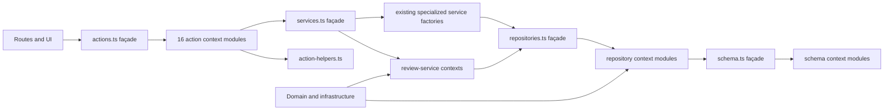

# Slice 35 module boundaries

Slice 35 separates the existing application into physical bounded contexts while
preserving the v0.34 public façades and behavior. Its frozen compatibility
baseline is 113 schema runtime exports (112 tables plus `schema`), 22 repository
classes, 67 core review-service methods, and 137 Server Actions.

## Dependency direction

The arrow points from a consumer to the module it depends on. Context modules
may import lower layers and shared helpers. They do not import their own root
façade, and lower layers do not import application services, Server Actions,
routes, or UI modules.

## Compatibility façades

| Public module | Context modules | Frozen contract |
| --- | --- | --- |
| `src/db/schema.ts` | `src/db/schema/` | Re-exports the released schema API. Its `schema` object keeps the exact v0.34 table key order. |
| `src/application/repositories.ts` | `src/application/repositories/` | Re-exports all 22 repository classes. |
| `src/application/services.ts` | `src/application/review-services/` plus existing specialized services | Composes the six core service factories and the existing specialized factories in the released order. |
| `src/app/actions.ts` | `src/app/actions/` and `src/app/action-helpers.ts` | Exposes the same 137 async actions through the application’s existing import path. |

The schema contexts group table definitions by workflow: foundation,
screening, documents and evidence, evidence sets, extraction, synthesis,
claims, manuscript, protocol search, research questions, intake, AI extraction,
AI synthesis, and appraisal. `shared.ts` contains definitions shared by those
contexts. No schema context imports the root `schema.ts` façade, so context
dependencies remain acyclic.

The repository contexts group Project/Paper, documents/evidence, claims,
screening, extraction, and synthesis repositories. Their barrel remains the
import boundary used by the rest of the application.

The six core review-service factories are `createProjectPaperServices`,
`createEvidenceServices`, `createScreeningServices`,
`createExtractionServices`, `createSynthesisServices`, and
`createClaimServices`. Their object methods retain their current implementations
and the receiver behavior required by the existing sibling `this.*` calls. The
composition order is frozen:

1. Core services: Project/Paper, Evidence, Screening, Extraction, Synthesis,
   Claim.
2. Base services: core `services`, Manuscript, Manuscript Prose History,
   Manuscript Review, Manuscript Snapshot, Acquisition, Deduplication, and
   Document.
3. Final services: base, Text Extraction, PDF Intake, Reporting, Curation,
   Critical Appraisal, Evidence Set, Synthesis Preparation, Synthesis
   Interpretation, Traceability, Coverage, Answer Write, Answer Read, Answer
   Manuscript, Project Workspace Read, and optional Bibliographic Import.

The only intentional collision is `createProject`: the core
`createProjectPaperServices` method is overwritten by
`acquisitionServices.createProject`, matching v0.34 precedence. Any other
duplicate service key is an architecture-test failure.

The actions façade and all 16 implementation modules begin with `'use server'`.
Each implementation module exports async runtime functions only. The façade
uses explicit async forwarding functions rather than ES module re-exports;
each wrapper preserves the implementation parameter names, positions, types,
and return type. The public Server Action compatibility façade uses async
forwarding functions rather than ES module re-exports because Next.js 15.5.26
does not reliably accept/register the desired re-export façade shape. Shared
helpers stay in the non-`use server` `src/app/action-helpers.ts` module.
Existing routes and client components keep importing actions from
`src/app/actions.ts`.

Action contexts are AI extraction, AI synthesis, appraisal, bibliographic
intake, claims, documents and evidence, DOI intake, evidence sets, extraction,
manuscript, PDF intake, projects and papers, protocol search, research
questions, screening, and synthesis.

## Architecture checks

`tests/architecture/module-boundaries.test.ts` uses the TypeScript compiler API
and the repository `tsconfig.json` resolver. It follows imports, re-exports,
type-only imports and exports, `export *`, aliases, dynamic imports, and import
types. It checks the schema DAG and root-facade boundary, cross-context cycles,
forbidden upward dependencies, compatibility exports and key order, all 137
action signatures and forwarding bodies, service ownership and composition,
intentional collisions, and unchanged configuration hashes. Service ownership,
composition, core method, and collision checks enable when the six
`review-services` modules are present.

The fixture at `tests/architecture/fixtures/slice35-v034-api.json` records the
v0.34 API, composition, migration/snapshot, and configuration manifests.
Migration and snapshot byte verification is also part of the release audit,
which compares the final checkout to the authorized baseline and accounts for
Windows checkout line endings.

## Scope boundary

This is a module-boundary refactor. It does not change the schema, migrations,
SQL, research behavior, validation or project-scoping rules, revision checks,
candidate revalidation, redirects, routes, UI, dependencies, or configuration.
